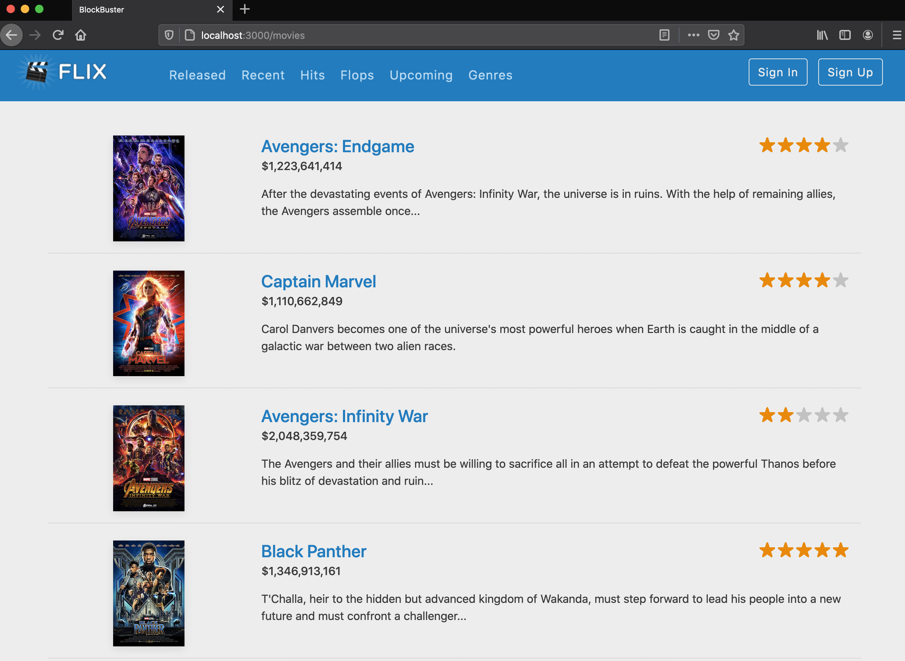

# Blockbuster

Blockbuster is a Ruby on Rails Application developed by m8051 as a result of the pragmaticstudio training course.

* Ruby version 2.6.3

* System dependencies

* Configuration

* Database creation

* Database initialization

* How to run the test suite

* Services (job queues, cache servers, search engines, etc.)

* Deployment instructions

* ...
